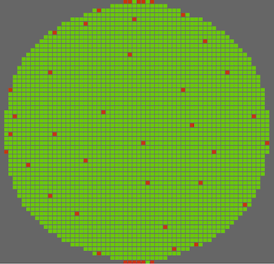

wafer-view |Build Status| |PyPi Version|
=======================================================

Wafer map viewer for semi.org XML standards written in Python

Summary
--------

The Wafer-View utility allows a generic XML wafermap file to be viewed. The tool parses the XML and generates bitmap images corresponding to the die status as defined in the wafermap XML file. Each die status can be individually enabled or disabled as well as their colors modified, to easily distinguish where on the wafer any failures occur. Total die, pass/fail, and yield results are also calculated and reported.


    
    wafermap


Installation
--------------

Pre-Requisites
```````````````

It is highly recommended to use a VirtualEnv to install the tool. This is done as follows (the location of the venv can be anywhere):

.. code-block::

   python -m ~/venv/waferview

Once created, you must activate the venv before running the tool:

.. code-block::

   source ~/venv/waferview/bin/activate


If you are running MacOS or Windows, please skip this next section.
For linux systems, you may need to install GTK. This is done as follows (using Debian commands as an example):

.. code-block::

   sudo apt-get update
   sudo apt-get install build-essential libgtk-3-dev

From PyPi (Preferred)
``````````````````````

Note: this should be done _after_ sourcing the venv

.. code-block::

   pip install wafer-view

From Github
`````````````

Clone the github repository and install

.. code-block::

    git clone https://github.com/fronzbot/wafer-view.git
    cd wafer\-view
    git checkout main
    <follow venv instructions here (from above)>
    pip install .

Usage
------

Once installed, running the command `waferview` will open up the Wafer View GUI. Using the File menu, an xml wafermap can be loaded and viewed. Each bin can be independantly enabled/disabled and the color scheme can be changed on the fly to easily find where failures occur on a die. The wafer image can also be saved as a bitmap.

Available keyboard shortcuts:

+--------------------+--------------------+
| Event              | Key(s)             |
+====================+====================+
| Pan Left           | Left Arrow         |
|                    +--------------------+
|                    | h                  |
+--------------------+--------------------+
| Pan Right          | Right Arrow        |
|                    +--------------------+
|                    | l                  |
+--------------------+--------------------+
| Pan Up             | Up Arrow           |
|                    +--------------------+
|                    | k                  |
+--------------------+--------------------+
| Pan Down           | Down Arrow         |
|                    +--------------------+
|                    | j                  |
+--------------------+--------------------+
| Zoom In            | Page Down          |
|                    +--------------------+
|                    | ]                  |
|                    +--------------------+
|                    | +                  |
+--------------------+--------------------+
| Zoom Out           | Page Up            |
|                    +--------------------+
|                    | [                  |
|                    +--------------------+
|                    | -                  |
+--------------------+--------------------+
| Fit                | f                  |
|                    +--------------------+
|                    | 0                  |
+--------------------+--------------------+
| Open               | Ctrl/Cmd + O       |
+--------------------+--------------------+
| Save               | Ctrl/Cmd + S       |
+--------------------+--------------------+

.. |Build Status| image:: https://github.com/fronzbot/wafer-view/workflows/build/badge.svg
   :target: https://github.com/fronzbot/wafer-view/actions?query=workflow%3Abuild
.. |PyPi Version| image:: https://img.shields.io/pypi/v/wafer-view.svg
    :target: https://pypi.python.org/pypi/wafer-view
